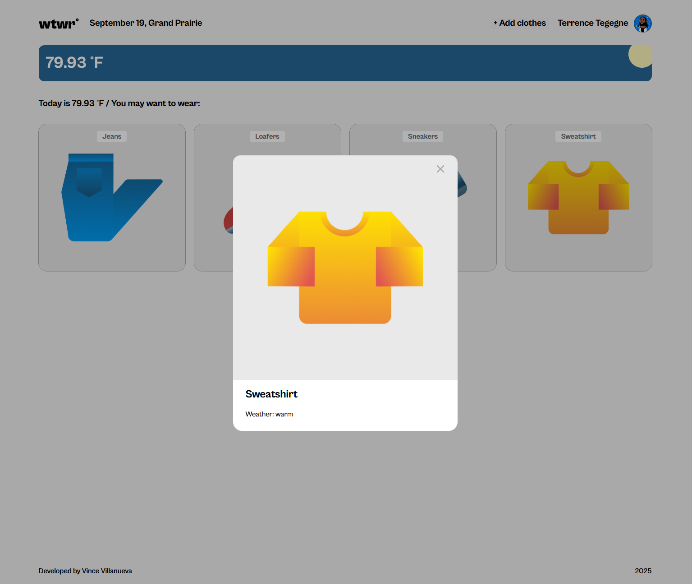

# WTWR (What To Wear)

A weather-aware wardrobe helper.

## Description

This app shows the current weather and suggests garments that match the conditions. You can add new items, preview them, and filter by weather type.

Marvel at its practicality 🧥☀️

## Tech Stack

- HTML
- CSS
- React
- Modern JavaScript (ES Modules)
- Asynchronous JS
- REST API
- Responsive Design

## Features

- Current weather (°F) with day/night artwork
- Clothing suggestions filtered by `hot` / `warm` / `cold`
- Add garment via modal form (name, image URL, weather type)
- Item preview modal
- Keyboard/overlay close behavior for modals

## Deployment

This webpage is deployed to GitHub Pages.

- [Deployment link HERE](https://yourdevvince.github.io/se_project_react/)

- [Backend link HERE](https://github.com/YourDevVince/se_project_express)
